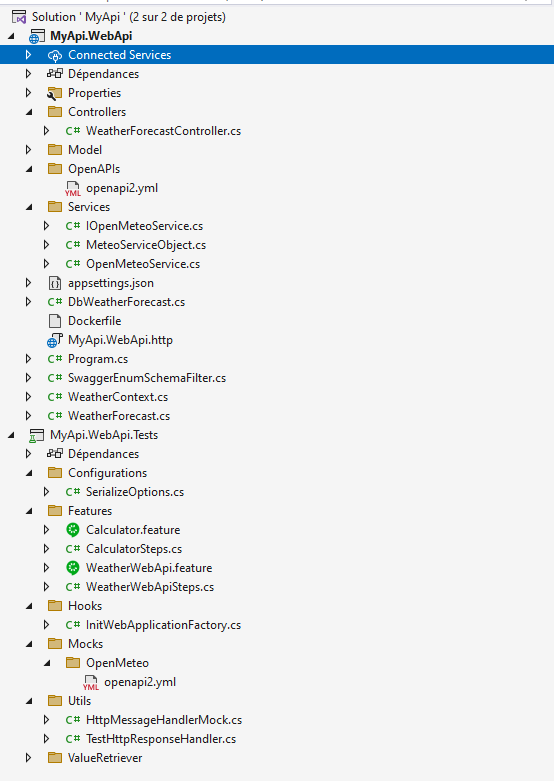
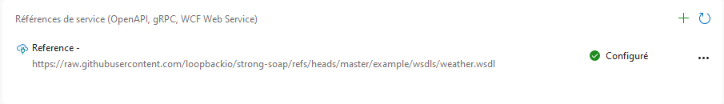
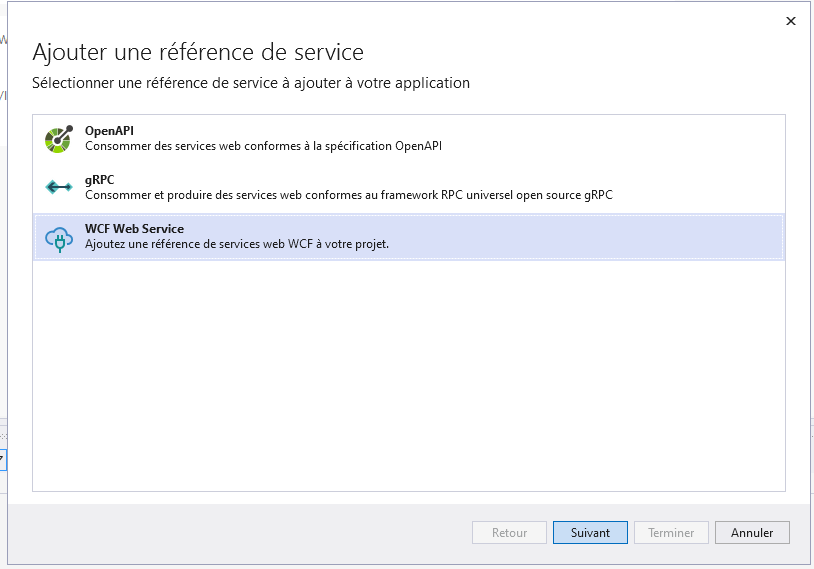
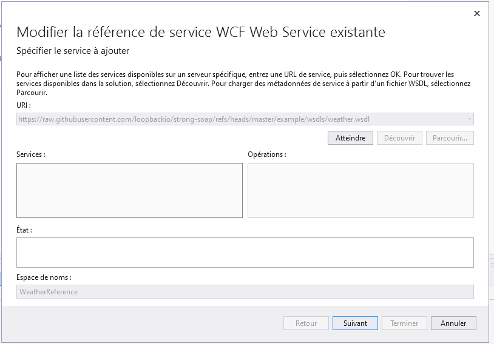

# Module 1: création du projet de test

## Qu'allons-nous faire?

Nous allons ajouter un service externe nommé [Weather](https://github.com/loopbackio/strong-soap/blob/master/example/wsdls/weather.wsdl), qui par la suite sera mocké dans les tests.

## Instructions

Démarrer avec le projet en jouant la commande suivante:

```
git clone https://github.com/CroquetMickael/SoapDotNetIntegrationTests.git --branch feature/init
```

Ajouter un service connecté via Visual studio



Cliquer sur le +



Choisir OpenAPI



Puis remplir avec les informations suivante:

- URL: https://raw.githubusercontent.com/loopbackio/strong-soap/refs/heads/master/example/wsdls/weather.wsdl
- Espace des noms : WeatherReference



Un fichier `.json` va être généré avec le nom fournit suivant `ConnectedService.json`, ainsi qu'un fichier `Reference.cs`

## Usage du nouveau service

Dans le projet MyApi.WebApi, créer un dossier `Services` et ajouter 3 classes:

- WeatherService
- CustomWeatherSoapClient
- IWeatherService

Nous commencerons par le fichier **CustomWeatherSoapClient**, nous allons modifier le constructeur pour recevoir l'URL d'appel et le binding SOAP associé.

```cs
using System.ServiceModel;
using System.ServiceModel.Channels;
using WeatherReference;

namespace MyApi.WebApi.Services;

public class CustomWeatherSoapClient : WeatherSoapClient
{
    public CustomWeatherSoapClient(Binding binding, EndpointAddress endpoint) : base(binding, endpoint)
    {
    }

    public static CustomWeatherSoapClient Create(string url)
    {
        var binding = new BasicHttpBinding();
        var endpoint = new EndpointAddress(url);

        var client = new CustomWeatherSoapClient(binding, endpoint);

        return client;
    }
}
```

Dans le fichier **WeatherService**, nous allons modifier le constructeur pour récupérer via injection de dépendance l'objet générer par les **Service Connecté** et nous allons aussi permettre l'implémentation de l'interface que vous venez de créer.

Nous allons ajouter la méthode `GetWeather` celle-ci permettra d'effectuer l'appel au service SOAP via l'objet injecté.

```cs
using WeatherReference;

namespace MyApi.WebApi.Services;

public class WeatherService : IWeatherService
{

    private readonly CustomWeatherSoapClient _weatherSoapClient;

    public WeatherService(HttpClient httpClient, string soapUrl)
    {
        _weatherSoapClient = CustomWeatherSoapClient.Create(soapUrl);
    }


    public async Task<WeatherReturn?> GetWeather(string codeZip)
    {
        try
        {
            var response = await _weatherSoapClient.GetCityWeatherByZIPAsync(codeZip);
            return response;

        }
         catch (Exception ex)
        {

        }
        return null;
    }
}
```

Ce que nous avons fait ici, appeller le service via l'objet généré avec le code ZIP que nous récupérons en paramêtre de la méthode.

Et maintenant, allons modifier le fichier `IWeatherService` qui est simplement l'interface de notre service, que nous utiliserons.

```cs
using WeatherReference;

namespace MyApi.WebApi.Services;

public interface IWeatherService
{
    Task<WeatherReturn?> GetWeather(string codeZip);
}
```

## Ajout de l'injection de dépendance

Dans le Program.cs, nous allons ajouter l'injection de dépendance pour notre service, cela est découpé en deux temps.

L'ajout de notre classe de service et son interface, puis l'ajout de l'HTTPClient pour notre service REST avec l'URL d'appel.

```cs
var weatherSoapConfigurationUrl = builder.Configuration.GetSection("WeatherSoapService")["BaseUrl"];

builder.Services.AddHttpClient<WeatherService>();

builder.Services.AddSingleton<IWeatherService>(provider => new WeatherService(provider.GetRequiredService<HttpClient>(), weatherSoapConfigurationUrl));

```

Pourquoi l'ajout de l'URL à la main, plus tard, quand nous voudrons tester, il faudra rajouter une URL custom.

## Modification des controllers existants

Nous avons besoin de modifier le constructeur de la classe des controllers pour que l'on puisse injecter le service.

```cs
private readonly WeatherContext _weatherContext;
private readonly IWeatherService _weatherService;

public WeatherForecastController(WeatherContext weatherContext, IWeatherService weatherService)
{
    _weatherContext = weatherContext;
    _weatherService = weatherService;
}
```

Une fois tout cela fait, nous ajoutons la route lié à notre appel de service de notre côté.

```cs
    [HttpGet]
    [Route("byZip")]
    public Task<WeatherReturn> GetWeatherByZip([FromQuery] string codeZip)
    {
        return _weatherService.GetWeather(codeZip);
    }
```

```
git clone https://github.com/CroquetMickael/SoapDotNetIntegrationTests.git --branch feature/module1
```

[suivant >](../Module%202%20Ajout%20des%20tests%20du%20service%20externe/readme.md)
