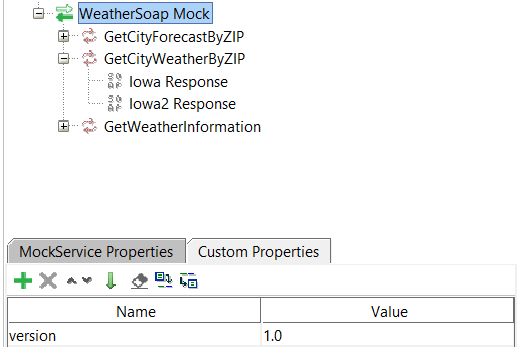

# Module 3: Usage de Microcks

Démarrer avec le projet du module précédent:

```
git clone https://github.com/CroquetMickael/SoapDotNetIntegrationTests.git --branch feature/module2
```

## Préambule

Dans ce module, nous allons découvrir et utiliser Microcks pour la gestion de nos mocks API. Pour que cela fonctionne, nous aurons besoin de `Docker` ou `Podman` car Microcks propose principalement des images docker pour son usage prévu en CI/CD ou en CAAS (Container As A Service).

Microcks bien que présenté ici en C#/.Net est utilisable en JAVA, NODE

## Démarrage du Docker Compose

### Podman

Pour Podman, pensez à démarrer votre machine `podman machine start` et lancer la commande `podman-compose up -d` dans le dossier `MyApi`.

### Docker

Démarrer votre Docker Desktop et lancer la commande `docker-compose up -d` dans le dossier `MyApi`.

Lancer ensuite votre navigateur sur l'URL [http://localhost:8585](http://localhost:8585).

Vous devriez arriver sur cette page:


### Que c'est-il passé ?

Microcks démarre un serveur pour fournir un environnement dans lequel les APIs simulées (mocks) peuvent être hébergées et accessibles. Cela peut être utilisé pour plusieurs raison :

1. **Accessibilité des Mocks** : En démarrant un serveur, Microcks permet aux développeurs d'accéder aux mocks d'API via des endpoints HTTP. Cela permet aux utilisateurs de tester leurs applications comme s'ils interagissaient avec une API réelle.

2. **Tests Locaux** : Un serveur local offre aux développeurs la possibilité de tester leurs applications sans dépendre d'une API externe, ce qui est particulièrement utile pour le développement local, les tests unitaires, et les tests d'intégration.

3. **Simulation du Comportement de l'API** : Le serveur peut simuler des comportements spécifiques de l'API, comme des réponses réussies, des erreurs ou des délais, permettant aux développeurs de vérifier comment leur application réagit dans différentes situations.

4. **Collaboration** : En ayant un serveur en cours d'exécution, les membres de l'équipe peuvent accéder aux mocks et les tester facilement. Cela facilite la collaboration entre les développeurs, les testeurs et les parties prenantes.

5. **Intégration dans des Pipelines CI/CD** : Dans le cadre d'un processus d'intégration continue et de déploiement continu (CI/CD), un serveur peut être utilisé pour effectuer des tests automatisés sur les mocks d'API, garantissant ainsi que les modifications apportées au code n'introduisent pas de régressions.

En résumé, le démarrage d'un serveur par Microcks permet de créer un environnement de test réaliste et accessible pour les développeurs, ce qui améliore l'efficacité du développement et la qualité des applications.

## Création d'un projet SoapUI

Pour que Microcks fonctionne et surcharge la référence de votre API avec des examples qui lui sont propre, nous allons donc créer un projet SoapUI.

Pour commencer, cliquer sur le bouton `SOAP` dans la barre d'outil de SoapUI.


Ensuite renseignez les informations suivante:

- Project Name: WeatherSoap
- initial WSDL: Path du WSDL utilisé pour générer le service dans le module 1.
- Create Request: coché
- Create Test Suits: coché


Une fois cela fait, nous allons créer un projet de Mock dans SoapUI, pour ce faire, faites clique droit sur la request `WeatherSoap` et faites `Generate SOAP Mock Service`.


Une fois cela fait, remplissez les informations de cette façon:


### Que venons-nous de faire ?

Nous venons de créer une projet SoapUI avec différentes informations référencé automatiquement via l'ajout du WSDL.

Mais nous avons surtout créer des testsSuits et un projet de Mock qui seront utilisé par Microcks, néanmoins, nous n'avons pas encore finit.

Microcks utilise une convention dans ses projets SoapUI pour lui permettre rapidement de faire le lien entre la requête et la réponse attendu dans son fonctionement.

CF: [Convention SoapUI Microcks](https://microcks.io/documentation/references/artifacts/soapui-conventions/)

## Ajustement du projet SoapUI avec la convention de Microcks.

Comme dit précédemment, nous devons suivre la convention de Microcks, commençons par les requêtes, nous allons donc créer 2 requêtes dans notre `Test Steps`.

Faites clic droit sur la référence de la fonction de l'API et faites : `Add Step => Soap Request`


Une fois cela fait, nommé votre requêtes `<ville> Request`, ici `<ville>` peut être le nom d'une ville que vous préférez.

Double cliquer sur votre nouvelle requête et placez-y le code ZIP que vous attendez.


Répétez l'opération une deuxième fois avec un code ZIP différent.

Une fois cela fait, nous allons nous attaquez aux retour de Mock dans le projet de Mock que vous avez créer auparavant.

Faites donc clique droit sur la requête que nous utilisons depuis le début et faites `New MockResponse`:


Une fois cela fait, nommé votre requêtes `<ville> Response`, ici `<ville>` doit être l'une des villes que vous avez choisis dans la Request que nous avions créer auparavant.

Il nous reste alors à ajuster la version API de notre service de MOCK, pour cela rien de plus simple, cliquer sur le projet, sélectionner `Custom Properties` et ajoutez-y:

- Name: version
- Value: 1.0



Nous avons normalement finit, mais vous vous demandez surement, "On a 2 requêtes, comment microcks connaît celle qu'il doit rendre en fonction de la requête d'entrée ?"

Vous avez bien raison, c'est pour cela qu'ils ont laissé la possibilité d'utiliser les `Matching Rules` de SoapUI a disposition.

### Les Matchings Rules, c'est quoi ?

Les "Matching Rules" (ou règles de correspondance) dans SoapUI sont des règles utilisées pour valider les résultats des tests fonctionnels.

Elles permettent de comparer la réponse attendue d'une requête avec la réponse réelle obtenue. Les "Matching Rules" peuvent être basées sur différents types de correspondance.

Il existe plusieurs type de Matching Rules:

- Random : cette méthode permet de générer une valeur aléatoire à chaque exécution du test, pour vérifier si la réponse obtenue contient une valeur aléatoire valide.

- Sequence : cette méthode permet de vérifier que les valeurs dans la réponse obtenue sont dans un ordre spécifique ou suivent une séquence prédéfinie.

- XPath : cette méthode permet de sélectionner et vérifier des nœuds XML dans la réponse en utilisant des expressions XPath.

- Script : cette méthode permet d'écrire un script personnalisé pour vérifier la réponse obtenue. Le script peut être écrit dans n'importe quel langage de script supporté par SoapUI, comme Groovy.

- Query_Match : cette méthode permet de vérifier que la réponse obtenue contient une chaîne de caractères spécifique en utilisant une expression régulière.

### Usage de Script dans notre projet

Nous allons utiliser les groovy script pour permettre de rendre une réponse dynamique en fonction de notre requête d'entrée.

Pour ce faire, dans le projet de Mock double cliquez sur la requête que nous utilisons depuis le début.


Dans `Dispatch`, choissisez l'option `SCRIPT`, vous aurez alors une sous fenêtre qui apparait, dans celle-ci nous allons renseigner le script suivant :

```java
import com.eviware.soapui.support.XmlHolder
def holder = new XmlHolder(mockRequest.requestContent)
holder.declareNamespace("weat", "http://ws.cdyne.com/WeatherWS/")
def zip = holder["//weat:GetCityWeatherByZIP/weat:ZIP"]

if(zip == "VOTRE CODE POSTAL"){
	return "<Ville> Response"
} else {
	return "<Ville> Response"
}

return "<Ville> Response"
```

Pensez a bien remplacer, `VOTRE CODE POSTAL` avec l'un des deux code postal que vous avez choisi dans vos requêtes à la base.

Ainsi que de remplacer `<Ville>` par vos 2 villes, pour le dernier return, choissisez celle que vous voulez par défaut en cas de non respect du code postal.

### Que fait ce script exactement ?

Ce script Groovy est utilisé dans SoapUI pour traiter une requête mock et renvoyer une réponse en fonction de la valeur d'un champ XML spécifique. Voici une explication détaillée de chaque partie du script :

#### Importation de la classe XmlHolder

```groovy
import com.eviware.soapui.support.XmlHolder
```

Cette ligne importe la classe XmlHolder, qui est utilisée pour manipuler le contenu XML dans SoapUI. XmlHolder facilite l'accès et la manipulation des données XML.

#### Création d'un objet XmlHolder

```groovy
def holder = new XmlHolder(mockRequest.requestContent)
```

Ici, un nouvel objet XmlHolder est créé à partir du contenu de la requête mock (mockRequest.requestContent). Cela permet d'analyser le contenu XML de la requête.

`mockRequest.requestContent` est un objet fournit par défaut dans le scope global de SoapUI.

#### Déclaration d'un espace de noms

```groovy
holder.declareNamespace("weat", "http://ws.cdyne.com/WeatherWS/")
```

Cette ligne déclare un espace de noms XML avec le préfixe "weat" et l'URL associée. Cela est nécessaire pour pouvoir accéder correctement aux éléments XML qui utilisent cet espace de noms.

#### Extraction de la valeur du champ ZIP

```groovy
def zip = holder["//weat:GetCityWeatherByZIP/weat:ZIP"]
```

Ici, le script utilise une expression XPath pour extraire la valeur du champ ZIP à partir du contenu XML. L'expression XPath spécifie que le script recherche l'élément ZIP dans l'élément GetCityWeatherByZIP de l'espace de noms "weat".

#### Conditions basées sur la valeur de ZIP

```groovy
if (zip == "90") {
    return "Iowa Response"
} else {
    return "Iowa2 Response"
}
```

Cette section vérifie la valeur de la variable zip. Si cette valeur est égale à "90", le script renvoie la chaîne "Iowa Response". Sinon, il renvoie "Iowa2 Response".

### Ajout du projet SoapUI dans le projet .net

Créons un dossier `Mocks` et un sous dossier `WeatherSoapMock` dans le projet de test .net à la racine.

Placez-y le fichier `.xml` du projet qui a été généré par SoapUI.

### Usage du fichier dans Microcks

Retourner sur l'URL de Microcks et cliquer sur `Importers` et cliquer sur `upload`.


Une fois fait, choisisser votre fichier.

Allez ensuite dans `API | Services`, vous devriez voir votre api custom.


Rentrer dedans et vous devriez voir 3 définitions d'appel dans les opérations.


Cliquer sur la définition de votre route API, vous pouvez ainsi copier l'URL fournit, renseignez la dans votre navigateur, vous aurez un retour en erreur car l'appel SOAP que nous utilisons demande un verbe HTTP de type POST

### Connectons notre API à notre serveur de mock

Utilisons ce service Mocké pour permettre à notre appel SOAP dans notre application de fonctionné, il vous faut modifier le `appsettings.json` en modifiant l'URL que vous aviez donné au service SOAP à l'origine par : `http://localhost:8585/soap/WeatherSoap+Mock/1.0`

Pour cette URL est pas simplement : `http://localhost:8585`, Microcks définit automatiquement le type de ressource par SOAP ou REST dans son url d'où pour commencer le `/soap` si nous avions mocké une réponse en rest nous aurions eu `/rest`.

Pour la suite, il reprend le nom de notre collection SoapUI au niveau des mocks et il y applique la version que nous lui avons donné donc : `/WeatherSoap+Mock/1.0`

Et il agrémente le tout avec l'url compléte : `/soap/WeatherSoap+Mock/1.0`

Un repo contenant une solution est disponible ici:

```
git clone https://github.com/CroquetMickael/SoapDotNetIntegrationTests.git --branch feature/module3
```

[suivant >](../../modules/Module%204%20Ajustement%20des%20tests%20pour%20usage%20de%20Microcks/readme.md)
