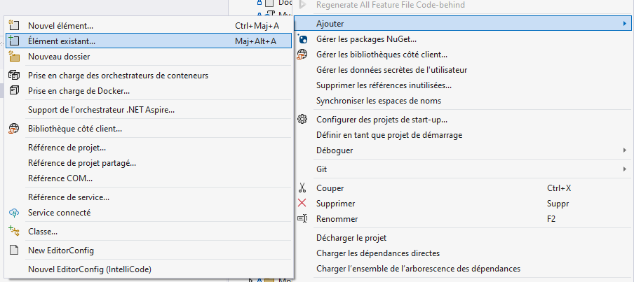
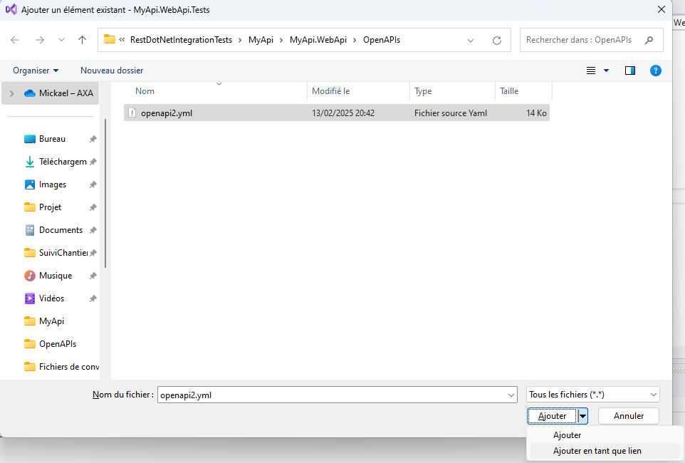
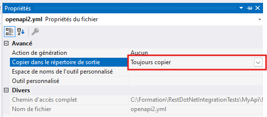

# Module 4: Ajustement des tests pour usage de Microcks

Démarrer avec le projet du module précédent:

```
git clone https://github.com/CroquetMickael/SoapDotNetIntegrationTests.git --branch feature/module3
```

## Préambule

Vérifier que vous avez bien `Podman` ou `Docker` de lancer pour pouvoir continuer ce Module.

### Faire des symlink des fichiers

Faire clic droit sur `MyAPI.WebAPI.Tests` et faire ajouter `élément existant`:



Sélectionner le fichier et faites le choix d'ajouter le fichier.



Cela permettra de simplifier une fonction que nous allons intégrer plus tard.

### Mettre en "Always Copy" les fichiers .xml

Assurer vous de bien mettre les fichiers .xml de votre Mock et dy symlink sur "Toujours copier"/"Always Copy" pour que les liens que vous avez fournit sois valide.



## Ajout du package Microcks et usage du test Container

Dans un premier temps, vous devriez installer Microcks dans la solution de test, le package Nuget ce nomme : `Microcks.Testcontainers` pour un soucis de practicité, cela est déjà fait, vous avez juste à passer à la suite 😊.

Modifions notre hook de démarrage, nous allons ajouter 2 paramètres, un public, l'autre privée qui seront utiliser pour démarrer le test container de Microcks.

```cs
internal class InitWebApplicationFactory
{
    ***
    private MicrocksContainer _microcksContainer = null!;
    internal Uri _microcksUrl;
```

Une fois cela fait, nous allons créer une nouvelle méthode privée pour démarrer le test Container:

```cs
  private async Task CreateApiTestcontainer()
 {
     _microcksContainer = new MicrocksBuilder()
        .WithImage("quay.io/microcks/microcks-uber:1.10.0")
         .WithMainArtifacts("Mocks\\Weather\\weatherSoapMock.xml")
        .Build();
     await _microcksContainer.StartAsync();
     _microcksUrl = _microcksContainer.GetSoapMockEndpoint("WeatherSoap Mock", "1.0");
 }
```

### Que fait cette fonction ?

- `.WithImage("quay.io/microcks/microcks-uber:1.10.0")`: Cela permet de définir l'image docker que l'ont va utiliser dans nos tests, il est souvent conseiller d'éviter de mettre `latest` dans les tests pour éviter d'avoir des soucis en cas de monté de version non prévu.

#### Les artifacts

Dans Microcks, les termes **primaryArtifact** et **secondaryArtifact** se réfèrent à des types d'artéfacts utilisés pour définir et simuler des APIs. Voici une explication des différences entre ces deux concepts :

#### Primary Artifact

Définit par `WithMainArtifacts` dans notre fonction.

- **Rôle** : Cet artéfact est utilisé pour générer les mocks d'API et pour effectuer des tests basés sur les spécifications qu'il contient. Il sert de base pour la simulation et le comportement attendu de l'API.
- **Importance** : C'est l'élément de base de notre API, il définit le contrat de service.

#### Secondary Artifact

Définit par `WithSecondaryArtifacts` dans notre fonction.

- **Rôle** : Ces artéfacts secondaires peuvent être utilisés pour fournir des données de test, des schémas supplémentaires, ou des configurations spécifiques qui ne sont pas couvertes par le primaryArtifact. Ils permettent d'ajouter de la richesse et de la diversité aux simulations.
- **Importance** : Bien qu'ils ne soient pas essentiels au fonctionnement de l'API simulée, les secondaryArtifacts peuvent améliorer les tests et les interactions en fournissant des contextes ou des données supplémentaires.

### En résumé

- **Primary Artifact** : Artéfact principal qui définit l'API et sert de base pour les mocks et les tests.
- **Secondary Artifact** : Artéfact supplémentaire qui enrichit ou complète le primaryArtifact, offrant des données ou des configurations supplémentaires.

#### Démarrer le container et récupérer l'URL

```cs
await _microcksContainer.StartAsync();
_microcksUrl = _microcksContainer.GetSoapMockEndp("WeatherSoap Mock", "1.0");
```

Ces deux lignes font principalement 2 chose:

- La première ligne démarre le test container de Microcks.
- La deuxiéme ligne récupére l'URI de notre service, en passant le Endpoint que l'on souhaite, ce endpoint est basé sur le openapi.yml que l'on a fournit dans la section `info` avec la propriété `title`

```xml
<?xml version="1.0" encoding="UTF-8"?>
<con:mockService id="341928eb-1c4d-4bd3-af2d-9026789b734aport="8088" path="/mockWeatherSoap" host="DESKTOP-430PKRKname="WeatherSoap Mock" dispatchResponseMessages="true">
```

### C'est quoi un test container ?

Un test container est une méthode de test qui utilise des containers pour exécuter des tests d'application dans un environnement isolé et reproductible. Cela permet de simuler des environnements de production et de s'assurer que le code fonctionne correctement avant d'être déployé.

#### Avantages des Test Containers

1. **Isolation** : Chaque test s'exécute dans un environnement propre, évitant les interférences entre les tests.
2. **Reproductibilité** : Les tests peuvent être exécutés dans le même environnement à chaque fois, ce qui réduit les problèmes liés à des différences d'environnement.
3. **Scalabilité** : Les containers peuvent être facilement créés et détruits, permettant de faire tourner des tests en parallèle.
4. **Intégration facile** : Ils s'intègrent bien avec les outils de CI/CD, facilitant l'automatisation des tests.

## Modifier le HTTP Client de test pour utiliser la nouvelle URL

Nous devons aussi modifier notre `ReplaceExternalServices` pour que notre HttpClient contacte maintenant, Microcks.

```cs
 public static void ReplaceExternalServices(IServiceCollection services, string url) {
     services.AddHttpClient<WeatherService>();

     services.AddSingleton<IWeatherService>(provider => new WeatherService(provider.GetRequiredService<HttpClient>(), url));
 }
```

Comme vous pouvez constater, nous avons retirer le `mockApiWeather`, cela veut maintenant dire que `.net` va utiliser directement l'url fournit par nous même.

Et pour finir, nous devons démarrer le container au début de chaque scénario, le `BeforeScenario` est prévu pour ça:

```cs
[BeforeScenario]
    public async Task BeforeScenario(ScenarioContext scenarioContext, IObjectContainer objectContainer)
    {
        _msSqlContainer = new MsSqlBuilder().Build();
        await _msSqlContainer.StartAsync();
        await PopulateDatabaseAsync();
        await InitializeRespawnAsync();
        await CreateApiTestcontainer();
        var application = new WebApplicationFactory<Program>().WithWebHostBuilder(builder =>
        {
            builder.ConfigureTestServices(services =>
            {
                RemoveLogging(services);
                ReplaceDatabase(services, objectContainer);
                ReplaceExternalServices(services, _microcksUrl.AbsoluteUri);
            });
        });

    var client = application.CreateClient();

        scenarioContext.TryAdd(HttpClientKey, client);
        scenarioContext.TryAdd(ApplicationKey, application);
    }
```

Vous pouvez lancer les tests, cela devrait maintenant être ok 😊.

## Et si on faisait un peu de clean de notre test

Comme vous vous en doutez, nous ne mockons plus via notre gherkin les réponses attendu du service, de ce fait, je vous invite à clean le gherkin et les steps associé.

Un repo contenant une solution est disponible ici:

```
git clone https://github.com/CroquetMickael/SoapDotNetIntegrationTests.git --branch feature/module4
```

[suivant >](../../modules/Module%205%20Association%20de%20deux%20services%20externe/readme.md)
